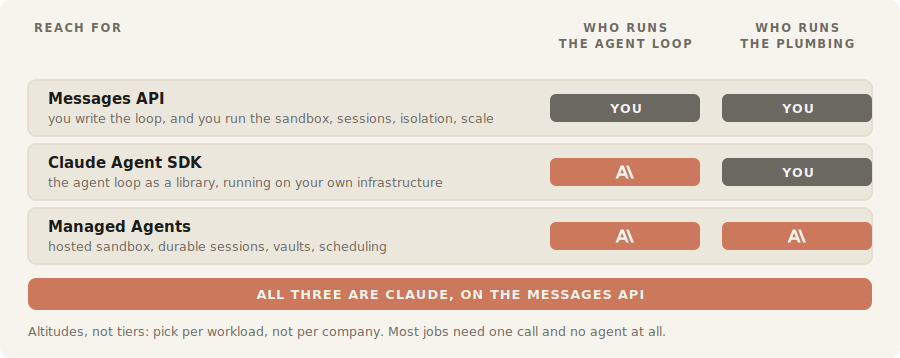
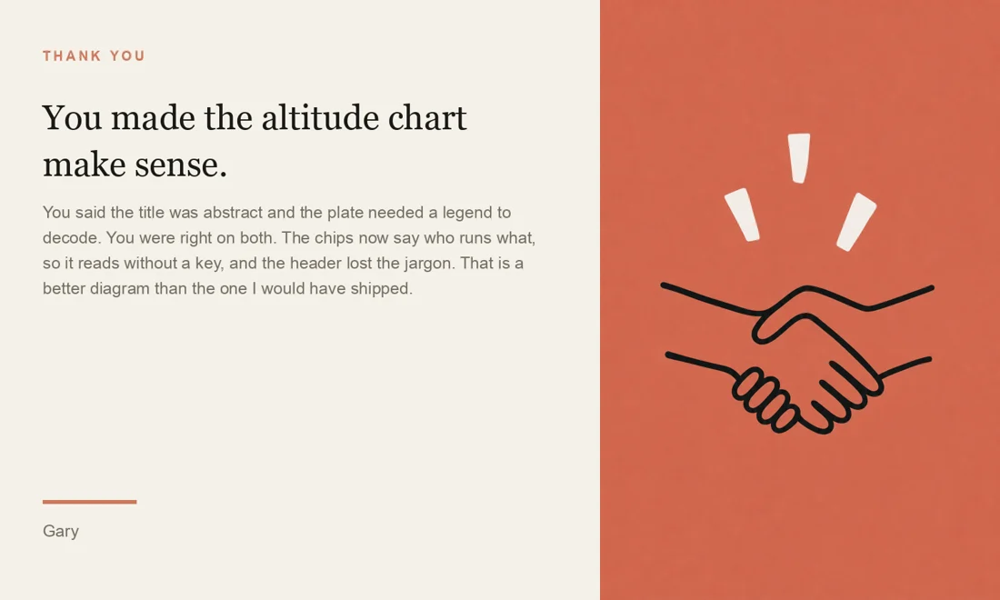
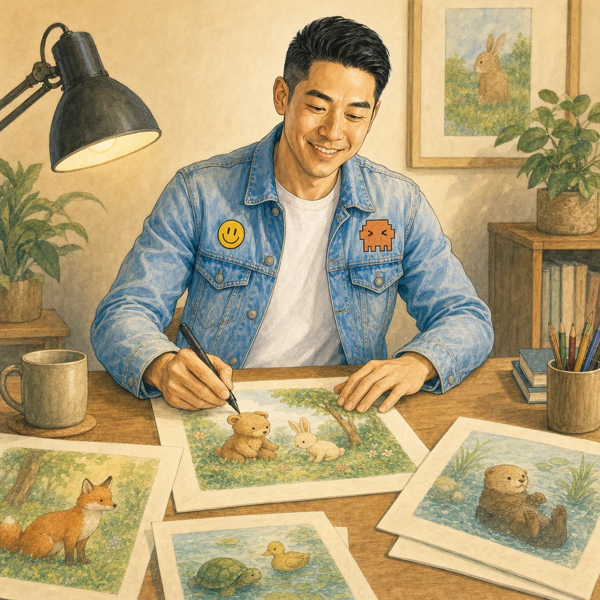

# The projections

This universe declares **six projections**: typed contracts for six genuinely different *kinds* of
deliverable. They exist to prove the [Agentic Brand Universe](https://github.com/garysheng/agentic-brand-universe)
standard generalizes past storybooks, which is the thing it was previously unable to demonstrate.

Every image below was produced by the composer from these contracts. None was hand-assembled.

---

## The ladder

Complexity in this standard is not a matter of taste. It is a **count**: how many invariants span more
than one slot. A cross-slot invariant is one that cannot be checked against a single output in
isolation, and it is the expensive class.

| Projection | Slots | Generators | Cross-slot | What it stresses |
|---|---|---|---|---|
| [explanatory-plate](#explanatory-plate) | 1 | **0** | 0 | whether "deterministic" means anything |
| [artful-plate](#artful-plate) | 1 | 1 | 0 | a style pack with no locked subject |
| [thank-you-card](#thank-you-card) | 2 | 1 | 0 | whether `extends` actually resolves |
| [share-card](#share-card) | 2 | 1 | 1 | code output and model output in one artifact |
| [flyer](#flyer) | 4 | 2 | 1 | one visual voice across several parts |
| [storybook](#storybook) | 2+ | 3 | 1 | identity holding across every page |

A meme has zero cross-slot invariants. A picture book has the hardest one there is. That is the whole
axis, and a team can read it off a contract before committing to build anything.

---

## explanatory-plate

**Zero generators.** No model touches this. It is emitted as SVG, because a diagram whose entire value
is that its labels are correct cannot survive a model that silently drops letters, and only vector
follows the reader's light or dark theme.



Emitter: `agenticstory:explanatory-plate`. Its gate is entirely **computed**, so it costs nothing and
runs on every render: palette-only, content fits the viewBox, column headers fit their column, title
and role present. Two real defects were caught by that gate alone, a clipped viewBox and two colliding
headers, both of which look fine in code and are obvious the moment they render.

It emits **two files from one source**: a theme-aware plate for the wiki and a light-locked copy for
an always-cream surface. That duplication used to be a manual step, which is exactly how a dark plate
once shipped onto a cream slide.

---

## artful-plate

One generated image, no recurring subject, no text ever.


This projection **pins its provider**, and the reasoning is the interesting part. Where a locked
golden carries the look, any competent model works. Here there is no golden: the model's own hand
*is* the register, so swapping the provider changes the brand. Pinning is correct precisely because
nothing else holds the style.

Its gate is entirely **judged**: no text anywhere, hands loopy and non-anatomical, at most four
elements, ground is one flat palette colour.

---

## thank-you-card

`extends: share-card`. It forks the two-panel structure rather than copying it, changing only the
surface and the text schema.



This is the projection that proved the contract was **not executable**. Its text panel declared
`{recipient, body, signoff}` and named nothing capable of laying that out, because field names are not
a layout. That is how the standard learned that a slot typed `deterministic` must name an emitter or
the type is decoration.

It also declared a 1200x1200 surface, which makes its art panel aspect **0.333**. No image generator
emits 0.333. The contract was internally coherent, reviewed, and undeliverable, which is how
`producibleAspects` and plan-time feasibility got into the standard.

---

## share-card

**The composite.** A text panel laid out by code, beside an art panel produced by a model, in one
artifact.


Systems that model rendering as a single template engine cannot express this, which is why composite
assets are almost always assembled by hand, twice, slightly differently.

Its one cross-slot invariant is **computed**: the art must be generated *at* the panel's aspect, never
cropped from a square. Cropping a square into a tall panel costs about 35 percent and takes exactly the
edges the composition needed, the wings and the outstretched hands. Generating at the panel's ratio
costs 2.4 percent.

---

## flyer

Four slots, three deterministic and one generated, with the first genuinely *judged* cross-slot rule:
one visual voice across the hero and the mark.

Nothing here is new mechanically. It exists in the ladder because it sits between "a card" and "a
book", and a standard that skips the middle of its own range has not been tested across it.

---

## storybook

The hard case, and the reason the rest of the standard looks the way it does.

| | |
|---|---|
|  |  |

Its cross-slot invariant is identity holding across every page, and getting it right took two
corrections that only execution revealed:

**Itemized, not gestalt.** The first version declared one rule: "character identity holds across every
spread." The bound character carried **fourteen** specific declared properties. Across six generated
spreads, twelve held and one failed in every single one. A judge asked *"is this the same person?"*
says yes and ships it. A judge walking the declared list catches it. Collapsing fourteen checkable
properties into one holistic question throws away all the resolution.

**Against the golden, never pairwise.** All spreads drifted the *same* way, because each inherited the
same drift in the same master-to-generation step. Compared with one another they are perfectly
consistent and uniformly wrong. **Consistency is not fidelity.**

Unlike `artful-plate`, this projection deliberately does **not** pin a provider: a locked character
golden carries identity, so any competent model can hold it. The same rule, applied honestly, lands in
opposite directions on two projections.

---

## Two registers in one composition

A book is not written in one visual language. The narrative pages are painterly and carry the
character; a diagram woven between them is flat, characterless, and belongs to a different register
entirely.

| Narrative register | Plate register |
|---|---|
|  |  |

Both came out of **one composition**. Registers bind per slot, not per artifact.

The guard that matters: the plate register lists the storybook cast among its rejected poles, so
handing a character's locked golden into a plate slot is two parts of canon contradicting each other.
The compiler **refuses** it, rather than passing the model a reference image that argues against its own
instructions and hoping it resists.

---

## Running any of this

```bash
# free, instant, no API: catches the failure classes above before you pay for anything
python3 <agenticstory>/skills/lint-universe/scripts/lint.py universe

# compose one artifact from a contract
python3 <agenticstory>/skills/compose/scripts/compose.py composition.json
```

The linter earned itself on its first run by finding a generated slot with no generator declared for
it, a bug that had been silently parking every cover as a defect.
