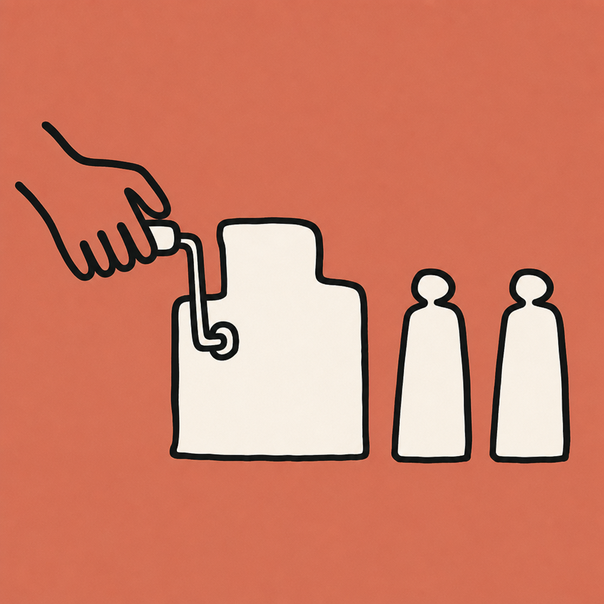

# The Outcome Economy

A four-plate `plate-book`: a short explanatory book told entirely in wordless plates, one per idea.
It is the worked example for [`plate-book`](../../universe/projections/plate-book.json), the
universe's first book with no cast.

**This book is INCOMPLETE, on purpose and on the record.** Three of its four plates passed an
independent judge. The fourth exhausted its roll budget and is parked as a defect. That is the
standard's failure model working, not a failed run, and publishing it complete-looking would misstate
what happened.

## What shipped

| Plate | Page text | Verdict |
|---|---|---|
| 1 | Nobody wants the tool. They want the thing the tool makes. | **DEFECT**, parked after 4 rolls |
| 2 | So stop selling the tool. Sell the machine that makes the outcome, again and again. | PASS, 8/8 items |
| 3 | The hard part was never making one. It was making the ten thousandth one just as good. | PASS, 8/8 items |
| 4 | Rent the slab. Keep the key. The key is the only part anyone can copy you for. | PASS, 8/8 items |




The concept is [The Outcome Economy](https://appliedai.wiki/concepts/the-outcome-economy).

## How it was judged

Every plate went to a **fresh independent judge** that was handed the artifact, the style anchor, and
an eight-item checklist, and was never shown the composition, the beats, or the compiled prompt. No
plate was passed by the agent that made it. The checklist came from the projection's own invariants
plus the resolved provider's registered quirks, so it assembled itself rather than being retyped.

## What the run cost, and what it taught

Eleven generations across four slots. Nine judged artifacts. The failures split into two kinds, and
the split is the useful part.

**Two failures were the author's, not the model's.** One beat described a grid as "receding" for a
style pack that rejects perspective outright, so the compiled prompt asked for "receding" and "no
perspective" in the same breath. Another enumerated a machine, a hand, and four bottles: six objects
against a declared ceiling of four. Both were caught by judges who had never seen a beat, and both
were fixed by repairing the beat rather than by arguing with the model. The composer now refuses a
scene that names something its pack rejects, before anything is generated.

**The rest were one provider behaviour.** Every remaining failure was a hand with four digits instead
of five. Registered as `stylized-hands-lose-a-digit` so no other project on this standard has to
rediscover it, and the linter now warns when a projection declares a rule its pinned provider is
known to break.

**The one that did not recover.** Plate 1 failed four rolls across two different scene framings,
including one rewritten to use a single hand rather than two, on the theory that each hand is an
independent chance to fail the hardest invariant. That theory holds in general (single-hand plates
passed quickly) and did not rescue this plate. Repairing it means one more roll, a relaxed invariant,
or a different provider. It does not mean re-running the book, which is the entire point of parking a
slot.

## Reproducing

```bash
python3 <agenticstory>/skills/lint-universe/scripts/lint.py universe
python3 <agenticstory>/skills/compose/scripts/compose.py composition.json
# slots return NEEDS-JUDGMENT. Dispatch one fresh judge per brief in work/judge/,
# write each verdict to work/verdicts/, then re-run. Passing slots resume free.
python3 universe/scripts/assemble-plate-book.py composition.json out/
```

The assembler refuses to build a book whose slots have not all passed, which is why there is no
`book-manifest.json` here.
